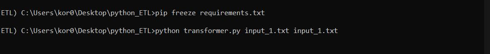
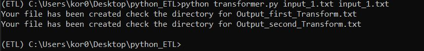

# python_ETL
 Simple ETL(Extarct Transform Load) python script:
 ------------------------------------------------
 --EXTRACT--
 
 Text file is extracted using --> with open(sys.argv[-2],'r') as data:
 
 then it goes to transfrom functions
 
 ===========================================
 
 --TRANSFORM--
 
 In this there are 2 transform functions to do operations on data which is in .txt format
 2 fucntions are:
 
  ---def captial_first_letter(file_name):
     -- to capitalize the first letter of the words in Text document
     
  ---def freq_of_words(file_name):
     -- to count the frequency of words in the Text file
     
 ============================================
 
 --LOAD--
 
  After transform 2 output files for each transfoem function is  created in the directory named
  - Output_first_Transform.txt   for def captial_first_letter(file_name):
  - Output_second_Transform.txt  for def freq_of_words(file_name):

-------------------------------------------------------
HOW TO EXECUTE
------------------------------------------------------

OPEN CMD AND TYPE

 python transformer.py filename1 filename2 
 
 where
 
 filename1  is for def captial_first_letter(file_name):
 
 and 
 
 filename2 is for def freq_of_words(file_name):
 
 ---------------------------------------------------
 IMAGES
 --------------------------------------------------
 INPUT
 

 OUTPUT
 
 

 
 
